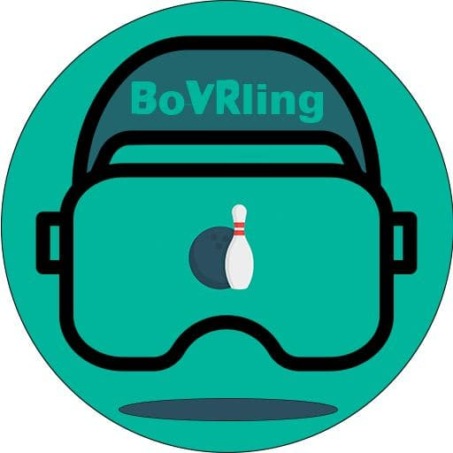

# boVRling 
<p align="center">
  
</p>


# Virtual and augmented reality laboratory - Htc Vive session
This simple  roject aims at teaching students basic concepts of Unity HMD development:
* SteamVR basics
* HTC-VIVE 

Additional material can be found [here](https://valvesoftware.github.io/steamvr_unity_plugin/).  

## Requirements
This project requires Unity [Unity 2018.4.35f1](https://unity3d.com/es/unity/whats-new/2018.4.35) you can install it through [Unity Hub] (https://unity3d.com/get-unity/download) **including android support**. 

However, this is a necessary but not sufficient condition to work with it. Indeed, you must download [Steam](https://store.steampowered.com/?l=italian) along with [SteamVR](https://store.steampowered.com/steamvr?l=italian). 

You also need to download and import in you Unity project, in the ```Asset``` folder, the [SteamVR plugin 2.2.0](https://github.com/ValveSoftware/steamvr_unity_plugin/releases/tag/2.2.0). This Unity packages includes, many useful object to develop cool VR experiences in hours.

## Export requirements
To export your application as an executable you have just to export it from the build settings in unity. If you have respected the requirements section statements, it should work.

## Windows Troubleshooting

The SDK, along with the NDK, can be installed in two different file system locations:
* The Windows **user** dir, precisely under ```C:\Users\**user**\AppData\Local\Android\```;
* In any directory of a non-system disk, as long as the father dir is named as **Android** (e.g. ```D:\Android\```).

##  Assets used from Unity store:
- [BarProps](https://assetstore.unity.com/packages/3d/props/barprops-137130);

##  External assets (only for unibo students)
- [Bowling ball and pins](https://liveunibo-my.sharepoint.com/:f:/g/personal/lorenzo_stacchio_studio_unibo_it/EnALqIgwh41Ku3vPV9kvMFQBcLDipEP_bs2eDAbXQnpaCA?e=uCZs4C);


##  Troubleshooting
- If controllers doesn't appear with the cited version of SteamVR plugin, you have to delete both Steam and SteamVRInput and import again, creating again base bindings using Window -> SteamVRInput -> Save & generate
