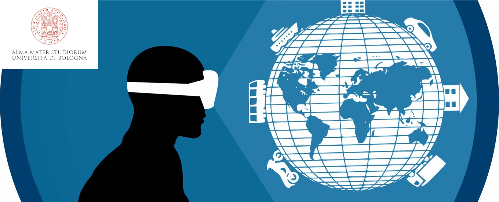

# Unibo Virtual Augmented Reality Lab 2022/2023

This repository contains some Unity projects presented during laboratory classes of the [Virtual and Augmented Reality Laboratory course](https://www.unibo.it/it/didattica/insegnamenti/insegnamento/2022/447969) at the [Alma Mater Studiorum University](https://www.unibo.it/en), taught by [Lorenzo Stacchio](https://lorenzo-stacchio.github.io/) member of the [VARLab](https://site.unibo.it/varlab/en). 

## General info
Each folder contains a Unity project, which could be divided into various Unity Scenes.
The slides of the classes can be found on [the virtual page dedicated to the course](https://virtuale.unibo.it/course/view.php?id=41333).

## Requirements
To open and use the project created during the lab lessons, you should install [Unity 2019.4.39f1](https://unity3d.com/es/unity/whats-new/2019.4.39).

You can install it via [Unity Hub](https://unity3d.com/get-unity/download) (**recommended**) by clicking [here](unityhub://2019.4.39f1/78d14dfa024b). 

You also need to download the [GoogleVRForUnity package](https://github.com/googlevr/gvr-unity-sdk/releases) and insert into project where is needed. This package is used to export a Unity application to android devices (read more [here](https://developers.google.com/cardboard/develop/unity/quickstart)).

Then, you will need an [HTC Vive](https://www.vive.com/us/) along with a working installation of [Steam](https://store.steampowered.com/) and [SteamVR](https://store.steampowered.com/steamvr?l=italian).

Finally, to use and deploy the [MRTK](https://github.com/microsoft/MixedRealityToolkit-Unity) apps introduced in these classes, you will need to download the **MRTK foundation** and **MRTK examples** unity packages for the target MRTK version from the [github release page](https://github.com/microsoft/MixedRealityToolkit-Unity/releases). 

More details about what to install are in the README file of different projects. 

## Course Program

| Date  | Topic | Professor | Slide | Practical material |
| ------------- | ------------- | ------------- |-----------------------------------------------------------------------------------------------------------------| ------------- |
| 1st class  | Unity basics | [Lorenzo Stacchio](https://www.unibo.it/sitoweb/lorenzo.stacchio2) | Not present | [Unity basics](Unity_basics/)    |
| 2nd class  | Unity android | [Lorenzo Stacchio](https://www.unibo.it/sitoweb/lorenzo.stacchio2) | Not present | [Android & Google cardboard](google_cardboard_sdk/)    |
| 3rd class  | Htc vive Unity basics | [Lorenzo Stacchio](https://www.unibo.it/sitoweb/lorenzo.stacchio2) | Not present | [Htc vive basics](Htc_vive_basics/)    [BoVRling](BoVRling/)   |
| 4th class  | Hololens and MRTK for Unity basics  | [Lorenzo Stacchio](https://www.unibo.it/sitoweb/lorenzo.stacchio2) | Not present | [MRTK basics](MRTK_basics/)|